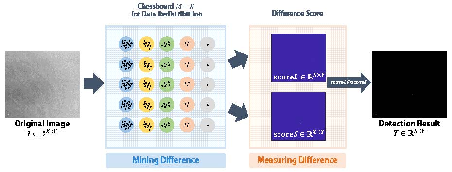

# Infrared dim-small target detection via chessboard topology

  

## Introduction
The code in this repository is the implementation of the methods and algorithms described in the paper "[Infrared dim-small target detection via chessboard topology](https://www.sciencedirect.com/science/article/abs/pii/S0030399224013252)," by B. Dan et al., published in Optics & Laser Technology. For detailed theoretical background and methodology, please refer to the paper.

## Acknowledgements

The code and experimental images provided in this repository are the property of the Institute of Optics and Electronics, Chinese Academy of Sciences. Unauthorized distribution, modification, or commercial use is strictly prohibited.

## Contact

For more information or inquiries regarding the IRSTD-Chessboard model and its applications, please contact [danbingbing20@mails.ucas.ac.cn].

## Related Work

\[1\] [Dynamic Weight Guided Smooth-Sparse Decomposition for Small Target Detection against Strong Vignetting Background](https://ieeexplore.ieee.org/abstract/document/10352345/) \\
\[2\] [One Shot is Enough for Sequential Infrared Small Target Segmentation](https://arxiv.org/abs/2408.04823)